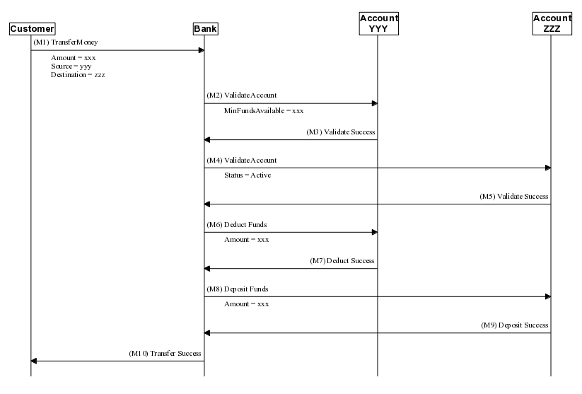

Meander
=======

This is a tool that reads a table from a 'source' file and generates a sequence message flow based the contents
of that table. Here is an example flow that outlines one (very incomplete/inaccurate) way that money might be
transferred between two accounts at a bank.

The source is a table in either a MS Word(r) or a OpenOffice/LibreOffice Writer document.

The output of the tool is either a MS PowerPoint(r) or OpenOffice/LibreOffice Impress presentation.

It does require that at least one of these two office suites has been installed.

The tool is built on top of the Griffon/Groovy platform, and will run on Linux and MS Windows. (It should also
run on Mac OS X, but that has not been tested.)
